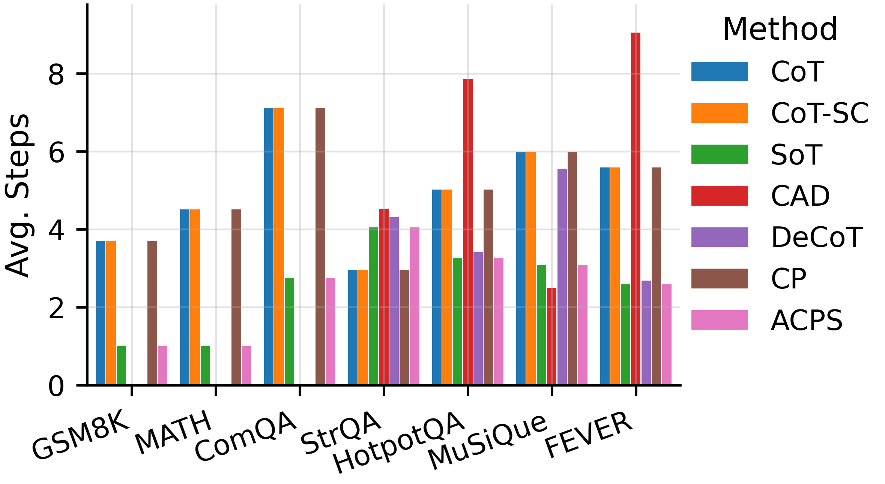
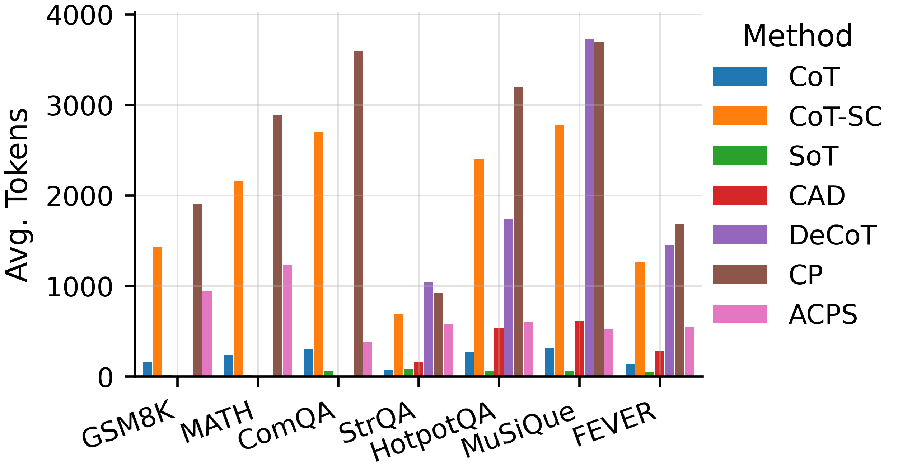
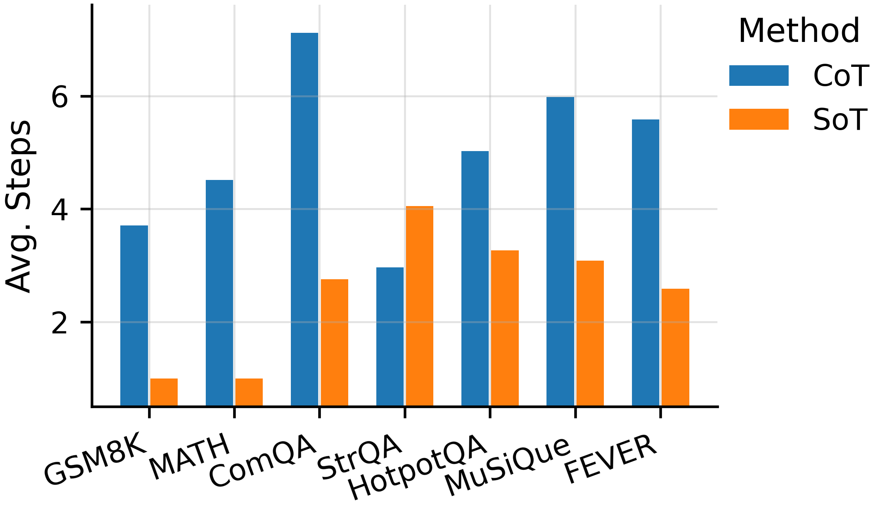
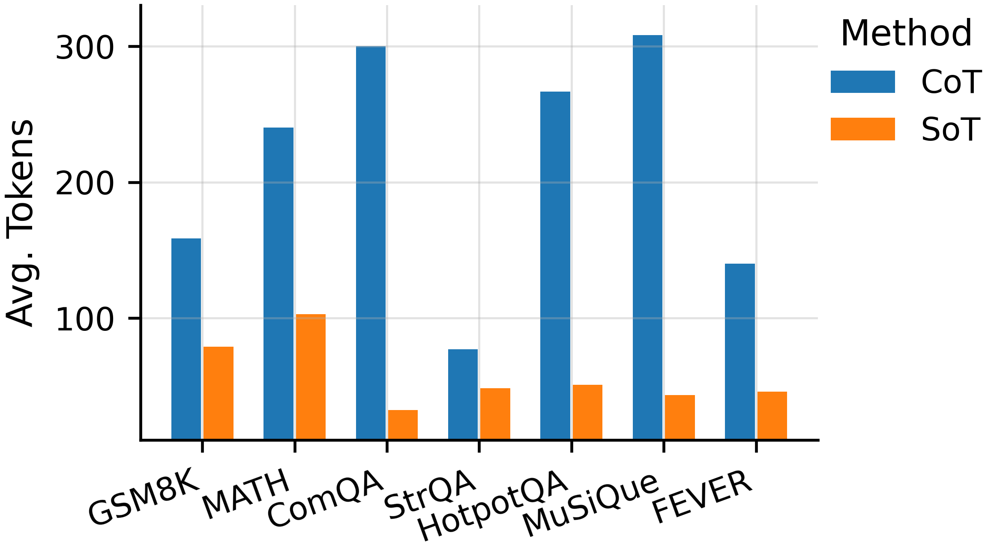
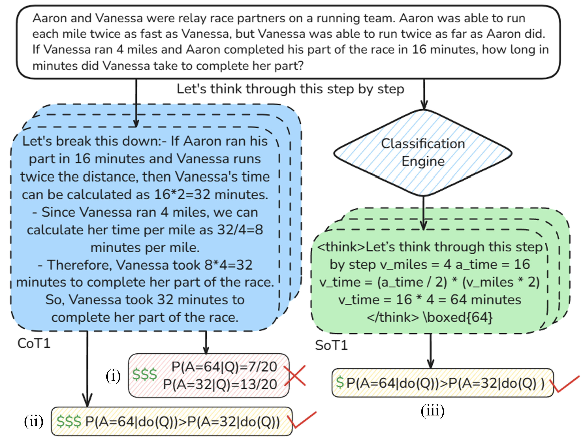
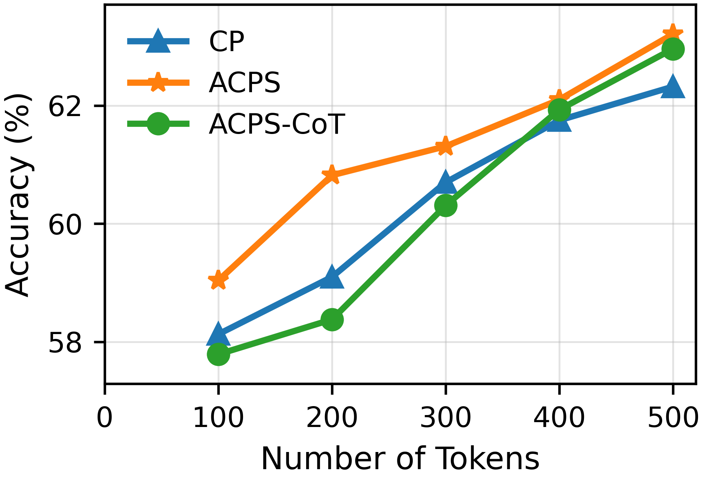
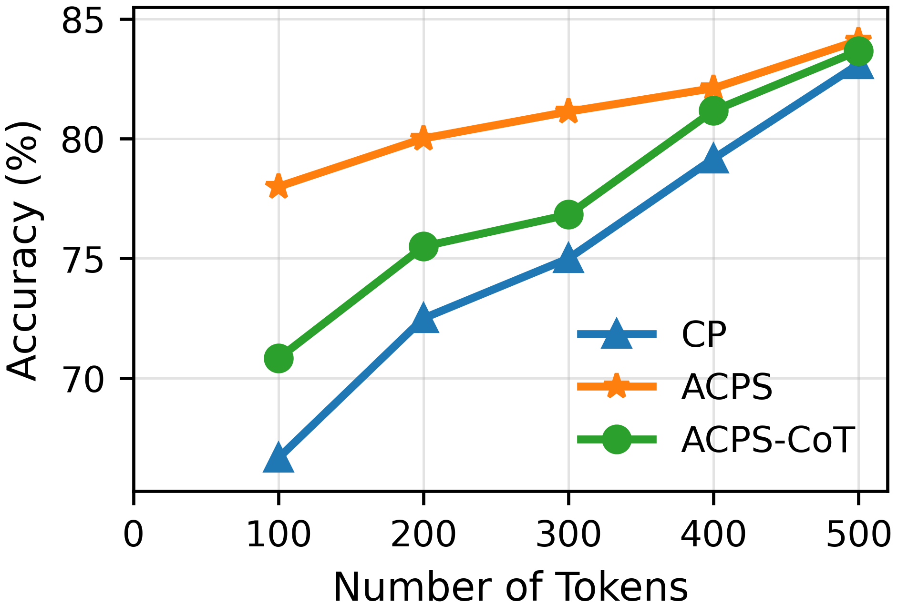

<h1 align="center"><b>Adaptive Causal Prompting with Sketch-of-Thought (ACPS)</b></h1>

<p align="center">
  
</p>

---

- Paper: **Debiasing Large Language Models via Adaptive Causal Prompting with Sketch-of-Thought** (OpenReview: https://openreview.net/forum?id=SdTSZ5GfV0)
- Authors: [Bowen Li](https://scholar.google.com/citations?user=D3-py-8AAAAJ&hl=en&authuser=1), [Ziqi Xu](https://scholar.google.com/citations?user=znODztEAAAAJ&hl=en&authuser=1&oi=ao), [Jing Ren](https://scholar.google.com/citations?hl=en&authuser=1&user=fUjL_jYAAAAJ), [Renqiang Luo](https://scholar.google.com/citations?hl=en&user=yx6HsssAAAAJ), Xikun Zhang, [Xiuzhen Zhang](https://scholar.google.com/citations?user=kuyecEEAAAAJ&hl=en&authuser=1), [Yongli Ren](https://scholar.google.com/citations?user=ZZl7bW8AAAAJ&hl=en), [Feng Xia](https://scholar.google.com/citations?hl=en&authuser=1&user=HDFA2VYAAAAJ)
- Venue: **EACL 2026 Findings** · Published: **04 Jan 2026** · Last modified: **04 Jan 2026**
- Keywords: Large Language Models, Reasoning, Prompting, Causality
- Licenses: MIT (code) · CC BY 4.0 (paper)

## TL;DR
ACPS adaptively routes between standard and conditional front-door adjustments and uses concise Sketch-of-Thought mediators to deliver robust, token-efficient reasoning across diverse tasks.

## Abstract
Despite notable advancements in prompting methods for Large Language Models (LLMs), such as Chain-of-Thought (CoT), existing strategies still suffer from excessive token usage and limited generalisability across diverse reasoning tasks. To address these limitations, we propose an Adaptive Causal Prompting with Sketch-of-Thought (ACPS) framework, which leverages structural causal models to infer the causal effect of a query on its answer and adaptively select an appropriate intervention (i.e., standard front-door and conditional front-door adjustments). This design enables generalisable causal reasoning across heterogeneous tasks without task-specific retraining. By replacing verbose CoT with concise Sketch-of-Thought, ACPS enables efficient reasoning that significantly reduces token usage and inference cost. Extensive experiments on multiple reasoning benchmarks and LLMs demonstrate that ACPS consistently outperforms existing prompting baselines in terms of accuracy, robustness, and computational efficiency.

## Paper Timeline
- 2026-01-04 — Camera-ready paper released (OpenReview submission 892) with aligned notebooks and assets.
- 2026 — Accepted to EACL 2026 Findings; presented to Conference Area Chairs, Reviewers, Publication Chairs, and Authors track.
- Next — Demo video and refreshed project page published (see `docs/` for GitHub Pages site).

## Project Page
- GitHub Pages uses the static site in `docs/` (Tailwind-based theme from the prior project). Configure GitHub Pages to serve from the `docs/` folder.
- Demo video embedded in `docs/index.html`: https://youtu.be/eH8ZuQz4rbI.

## Repository Map
- `acps/` — Task-specific ACPS notebooks (CommonsenseQA, FEVER, HotpotQA, GSM8K, Math, StrategyQA, MusiQue).
- `acps.ipynb` — End-to-end ACPS pipeline (routing, mediator construction, evaluation).
- `helpers/` — Sketch-of-Thought utilities, encoder fine-tuning, prompt templates, metrics collection.
- `sots_datasets/` — Builders for Sketch-of-Thought datasets per benchmark.
- `efficiency_comparison/` — Efficiency experiments and analysis.
- `robustness_study/` — Robustness evaluations on shuffled and injected datasets.
- `img/` — Figures for documentation and the project page.
- `requirements.txt` — Full dependency list (matches Kaggle Python 3.11.13 environment).
- `CITATION.cff` — Citation metadata.

## Environment & Usage
- Verified in a Kaggle `Python 3.11.13` GPU container. The dependency list is heavy; trim it if you only need specific notebooks.
- Quickstart:
  1. Open a Kaggle notebook (GPU recommended) and set Python 3.11.13.
  2. Install dependencies: `pip install -r requirements.txt` (or install selectively for the target notebook).
  3. Run `acps.ipynb` for the full pipeline, or a task notebook under `acps/` for a specific benchmark.
  4. Use `sots_datasets/` notebooks to regenerate Sketch-of-Thought mediators; use `robustness_study/` and `efficiency_comparison/` for robustness and efficiency analyses.
- Outputs are notebook-driven; no standalone Python package is provided yet.

## Figures (quick view)
<p align="center">
  
  
</p>
<p align="center">
  
  
</p>
<p align="center">
  
  
</p>
<p align="center">
  
  
</p>

Captions (left → right, top → bottom):
- Average reasoning steps under causal routing; average tokens under causal routing.
- Reasoning steps and tokens comparing Chain-of-Thought vs Sketch-of-Thought.
- Aggregate CoT vs SoT performance; tokens vs accuracy on HotpotQA.
- Tokens vs accuracy on StrategyQA; ACPS causal diagram.

## Revision Note (meta-review response)
ACPS extends causal prompting by supporting both context-free and context-dependent reasoning through adaptive selection between standard and conditional front-door adjustment. Lightweight per-instance routing combines with Sketch-of-Thought mediators (diverse sampling + clustering) to preserve reasoning diversity while reducing tokens. The revision clarifies efficiency accounting and the interaction between routing, mediator construction, and causal estimation.

## Citation
Use `CITATION.cff` or the BibTeX below.

```bibtex
@inproceedings{li2026acps,
  title     = {Debiasing Large Language Models via Adaptive Causal Prompting with Sketch-of-Thought},
  author    = {Bowen Li and Ziqi Xu and Jing Ren and Renqiang Luo and Xikun Zhang and Xiuzhen Zhang and Yongli Ren and Feng Xia},
  booktitle = {Findings of the Association for Computational Linguistics: EACL 2026},
  year      = {2026},
  month     = {January},
  note      = {OpenReview id: SdTSZ5GfV0}
}
```

## License
MIT License for code; paper content under CC BY 4.0.

## Contact
Please open a GitHub issue for questions, reproduction notes, or collaboration inquiries.
