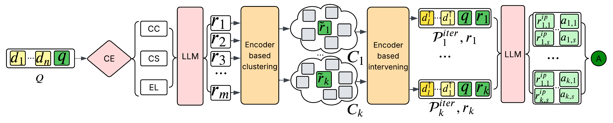
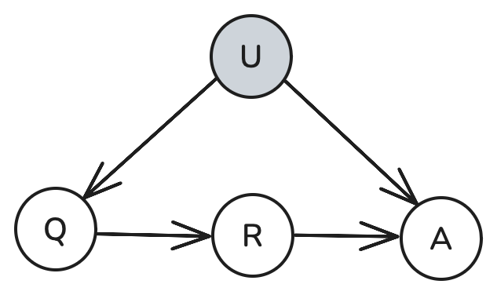
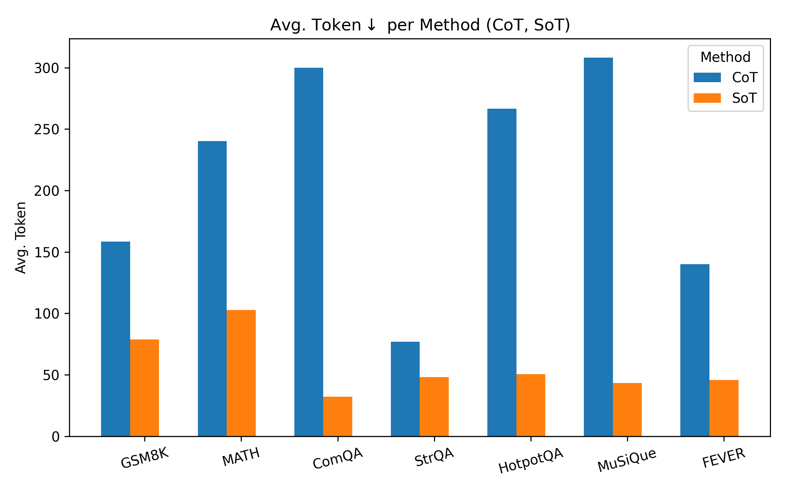
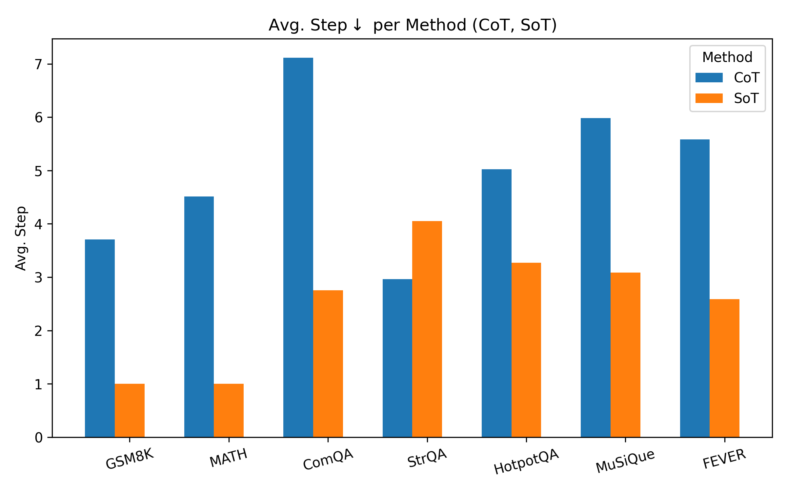
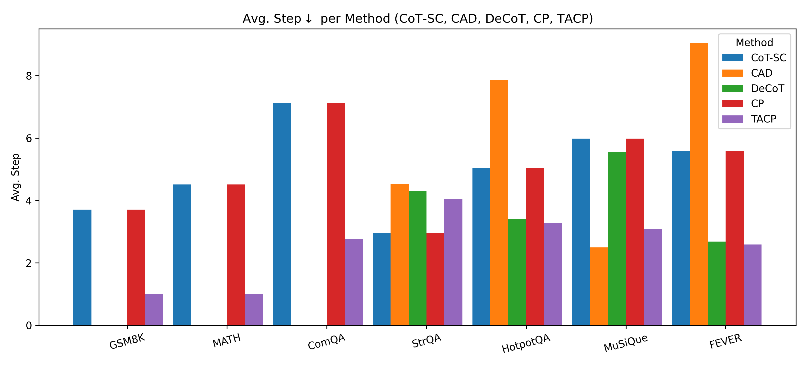

<h1 align="center">
   
  <b>Debiasing Large Language Models via Adaptive Causal Prompting</b> 
  <b>with Sketch-of-Thought</b> 
</h1>

  📚 <a href="">[Paper]</a> |
  📝 <a href="">[Blog Post]</a> |
  📂 <a href="">[Drive Folder]</a>

  

<h3>Abstract</h3>
Despite notable advancements in prompting methods for Large Language Models (LLMs), such as Chain-of-Thought, current strategies still suffer from inefficiency due to excessive token usage and limited generalisability across diverse reasoning tasks. To address these limitations, we propose an \textbf{A}daptive \textbf{C}ausal \textbf{P}rompting with \textbf{S}ketch-of-Thought (\textbf{ACPS}) framework, which leverages structural causal modelling to infer query-specific causal dependencies and apply suitable front-door interventions. This enables generalisable causal reasoning across heterogeneous tasks without task-specific retraining. By replacing verbose Chain-of-Thought with concise Sketch-of-Thought, ACPS achieves streamlined reasoning that substantially reduces token usage and inference cost. Extensive experiments on multiple reasoning benchmarks and LLMs demonstrate that ACPS consistently outperforms existing prompting baselines in terms of accuracy, robustness, and computational efficiency.~\footnote{The source code and technical appendix are provided in the Supplementary Material.}
 

  
  
  
    
<b>Figure: 2</b> Three SCMs illustrate different modes of answer generation in LLMs: (a) direct prompt-to-answer generation without explicit reasoning; (b) standard front-door adjustment for tasks without external knowledge, such as CP and DeCoT; and (c) conditional front-door adjustment for tasks with external knowledge. Both (b) and (c) are integrated into the proposed acps framework. In all SCMs, \( Q \) denotes the input query, \( R \) denotes the reasoning process (SoT or CoT), \( A \) denotes the final answer, \( U \) denotes the latent confounder, and \( E \) denotes the external knowledge..

 

<h3>Token Efficiency</h3>

  
  
  
<b>Figure: 3</b> Comparison of average token/reasoning steps usage between CoT and SoT on identical questions across multiple reasoning tasks.

 

  
  
  
<b>Figure: 4</b> Comparison of average token/reasoning steps usage between prompting frameworks across all tasks.

 

  
  
<b>Figure: 5</b> Comparison of Token Efficiency of Causal Prompting and acps on GPT-3.5 (StrategyQA \& HotpotQA).

 

# Environment Detail

All the code are run inside [Kaggle container `Python 3.11.13` environment](https://github.com/kaggle/docker-python). You can also check the [requirements.txt](./requirements.txt) file.

# Project Structure

- **efficiency_comparison/**: Code for the efficiency comparison experiment.
- **helpers/**: Implementation of SoT and the encoder used in the paper.
- **robustness_study/**: Code for the robustness study implementation.
- **sots_datasets/**: Code to build the SoT for queries inside the dataset.
- **acps/**: Code for the main experiment, ablation studies, and hyperparameter tuning.
- **acps.ipynb**: Implementation of the acps framework.

# Citation

Please check the Citation feature of this repo.

# LICENSE

Under [MIT](./LICENSE).

# Acknowledgement
* https://github.com/SimonAytes/SoT

Thanks for your contribution.