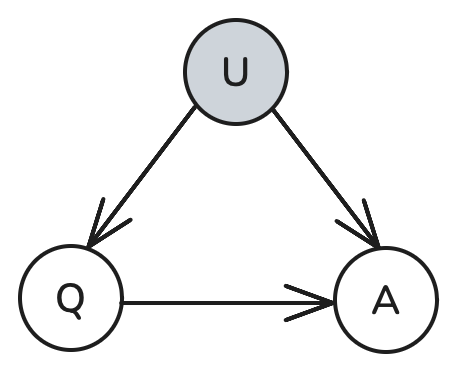
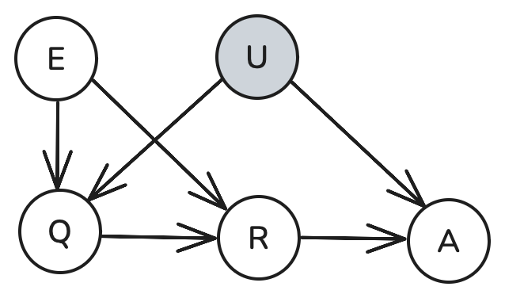
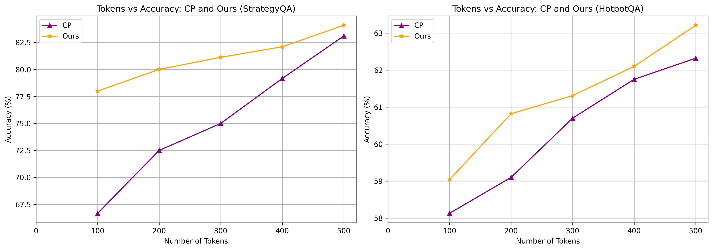

<h1 align="center">
   
  <b>Task-Aware Causal Prompting with Efficient Reasoning</b> 
  <b>for Large Language Models</b> 
</h1>

  📚 <a href="">[Paper]</a> |
  📝 <a href="">[Blog Post]</a> |
  📂 <a href="">[Drive Folder]</a>

<h3>Abstract</h3>
Large language models (LLMs) have demonstrated impressive capabilities across a wide range of reasoning tasks, but they often suffer from inefficiencies and internal biases when prompted using conventional methods such as Chain-of-Thought (CoT). Recent efforts to incorporate causal inference into prompting frameworks have shown promise in mitigating such biases, yet they typically rely on verbose reasoning and strong assumptions that limit their scalability and practical use. In this work, we propose TACP, a task-aware causal prompting framework designed to improve both generalisability and efficiency. TACP introduces a classification engine to select between standard and conditional front-door adjustment based on task characteristics, and replaces CoT with Sketch-of-Thought (SoT) to reduce token usage and inference cost. Extensive experiments on multiple LLMs and reasoning benchmarks demonstrate that TACP achieves consistently better accuracy, robustness, and efficiency compared to existing prompting baselines. Our results highlight the potential of task-aware causal reasoning for scalable and trustworthy LLM deployment.
 

  
  
  

 

<h3>Token Efficiency</h3>

  

# Environment Detail

All the code are run inside [Kaggle container `Python 3.11.13` environment](https://github.com/kaggle/docker-python). You can also check the [requirements.txt](./requirements.txt) file.

# Project Structure

- **efficiency_comparison/**: Code for the efficiency comparison experiment.
- **helpers/**: Implementation of SoT and the encoder used in the paper.
- **robustness_study/**: Code for the robustness study implementation.
- **sots_datasets/**: Code to build the SoT for queries inside the dataset.
- **tacp/**: Code for the main experiment, ablation studies, and hyperparameter tuning.
- **tacp.ipynb**: Implementation of the TACP framework.

# Citation

Please check the Citation feature of this repo.

# LICENSE

Under [MIT](./LICENSE).

# Acknowledgement
* https://github.com/SimonAytes/SoT

Thanks for your contribution.